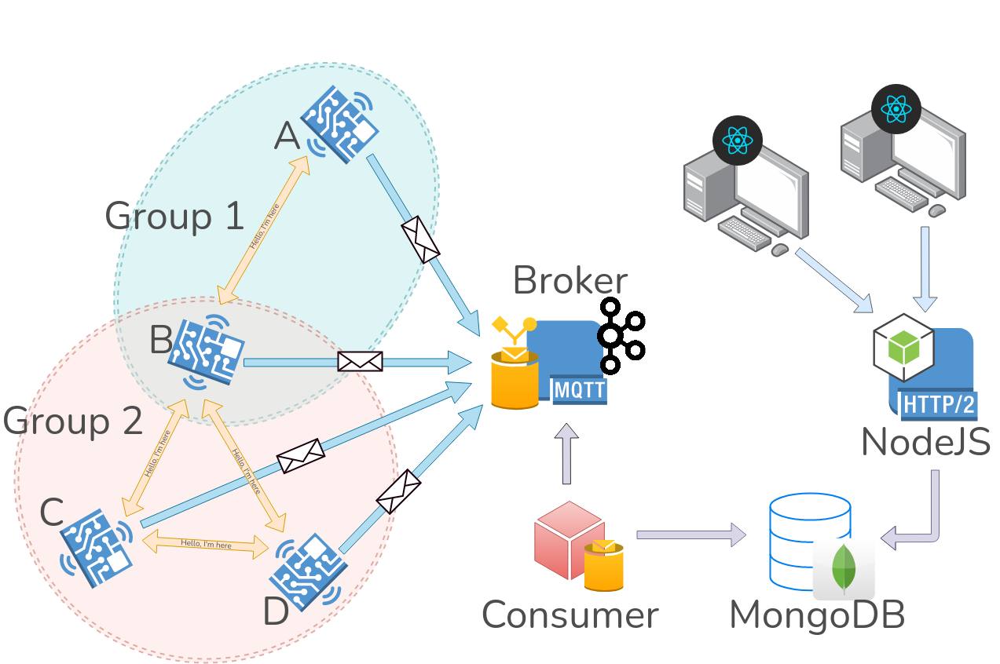

# CoronaZ: Simulating a contact tracing application in a scalable environment

This project was developed for the *Distributed Systems* course at the University of Helsinki in the accademic year 2020 - 2021.

## Introduction

This project simulates a contact tracing application where each node represents a person (or a unique device attached to someone) that send signals to each other when in range and communicate the data collected to a server using the *publish-subscribe* pattern.
The server, called *broker*, can then be polled by a node called *consumer* that will send the data to a database.
A front-end application then requests this data and displays the movement and the latest updates via the browser.

The idea came from simulating this kind of movements with Arduino boards capable of communicating between themselves using the *nrf24l01* and to the broker with *esp8266*.
Unfortunately this was not possible given the relatively strict amount of time that each of the students involved could dedicate to the project and the waiting time to get the necessary hardware.

Here is the architecture of the whole system.

The programming task can be found in the [Programming Task](Programming Task.pdf) file.
A more complete description of the project can be found in the [essay.pdf](essay/essay.pdf) file and a video simulation can be found [here](https://youtu.be/RhMn2ERpSIQ).

## Instructions to start the project

To start the project just execute the script `./init-project.sh` in the repository's main folder.
This script will ask for the configuration parameters, will run a `docker-compose up --build` command to build the network and main components, will allow for scaling up the number of nodes and desmantling the docker containers with a final `docker-compose down -v` command.

## Developers:

This project was developed by:
- [Ciprian Voinea](https://www.linkedin.com/in/cvoinea/)
- [Fabian Rensing](https://www.linkedin.com/in/fabian-rensing-75aa941b8/)
- [Stefan Vladov](https://www.linkedin.com/in/stefan-vladov-854ab5186/)

## Icons contributions:
- Coronavirus icon: https://www.flaticon.com/authors/freepik
- Zombie icon: https://www.flaticon.com/authors/dinosoftlabs
- Human icon: https://www.flaticon.com/authors/freepik
- Tombstone icon: https://www.flaticon.com/authors/freepik

